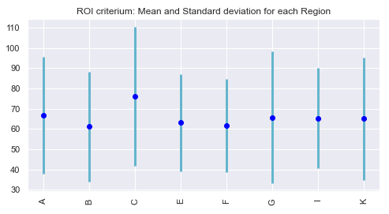
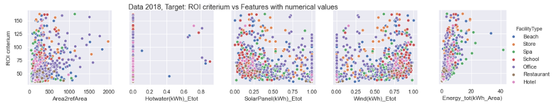

# From linear regressions to exapandle neuronal networks: contract selection in renewable energy businesses
ROI criterium is predicted based on several dataframes and regression algorithms and expandable neuronal networks to choose more accurately our clients while making B2B contracts in the renewable energy businesses.

First of all the dataframe is cleaned and statics are performed on the features. There are features with categorical values: Region, FacilityType and energies: 
Hotwater, electricy based on SolarPanel, Wind and the total energy (Energy_tot) and an Area divided by a area of reference (Area2refArea).

Here boxplots for the feature containing numerical values and the barplot of the feature region containing categorical values are displayed.

A closure look on the data is done by displaying the distribution of the features, here 'Area2refArea'. Mean and standard deviation for each categories of specific features are computed versus the target, here here ROI criterium.

Furthermore one can observe each feature in respect to the target but also to a feature containing categorical values, here the FacilityType.

Two features containing categorical values can also be observed  in respect to the target: the ROI criterium.

Finally in the notebook Nb2_EOL_f, regressions and expandale neuronal networks are built, trained and tested for dataframes built on different features. Feature selections, PCA, FAMD are performed.
Here are some of the regression studied: Linear Regression, Ridge Regression, Lasso, SVR, Random Forest, Gradient boosting, XGBoost. 
Adaboost is selected with dataframe 1 where the main features of decisions are the energy at stake, the area for the energy device, energy produced by solar panel and the regions. The accuracy is above 90% for computational time below 0.1 seconds. 

Future work for the regressions: Perform this study with similar dataframes but only based on one feature containing categorical values: Region or FacilityType.

Future work for the neuronal networks: Perform this study of all dataframes for the more strict convergence criteria and implement a Bayesian Optimization.

